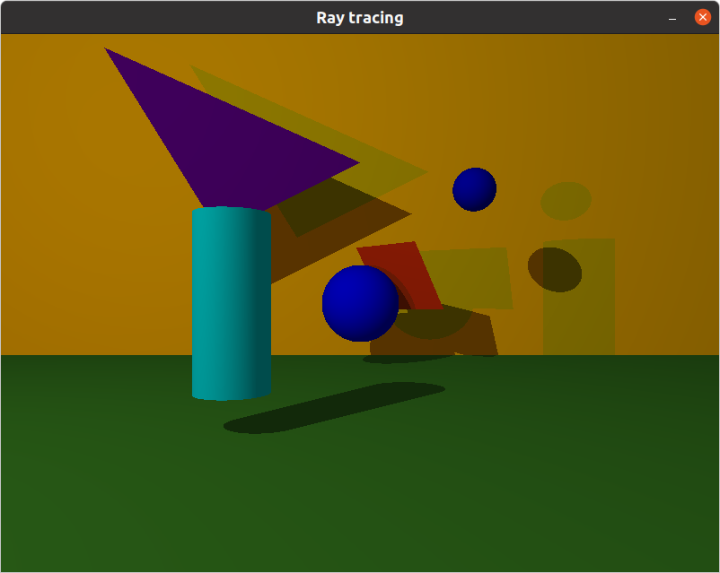
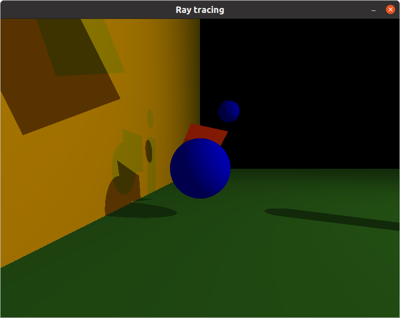
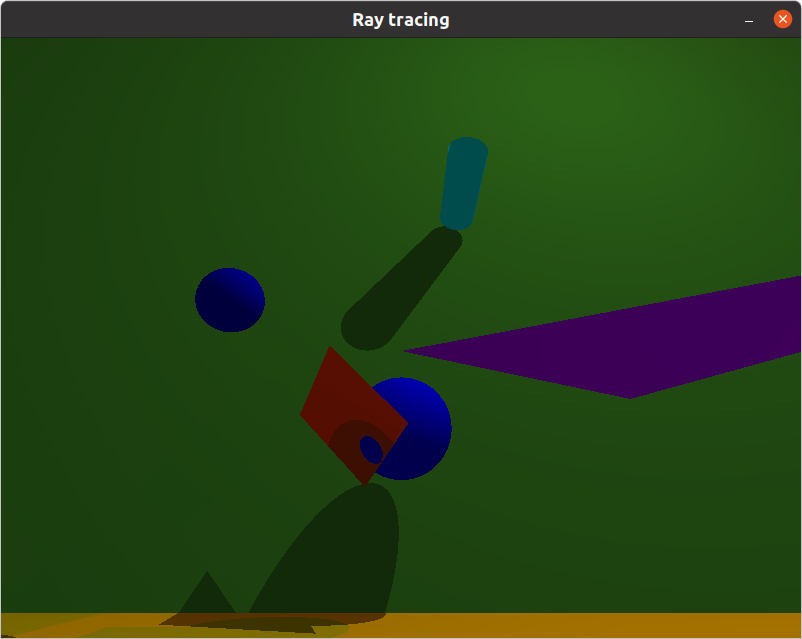

#  Ray Tracing (for Linux)

## About project
Graphical ray traycer in C. Renders multi-object scenes with colored lights.

The program displays the image in a window:
  * The arrow buttons switch the camera view.
  * Button ESC closes the window and exits the program.

Each element first’s information is the type identifier (composed by one or two
character(s)), followed by all specific information for each object in a strict
order such as:
* Ambient lightning: A 0.2 255,255,255
  * identifier: A
  * ambient lighting ratio in range [0.0-1.0]
  * R,G,B colors in range [0-255]
* Camera: C -50.0,0,20 0,0,1 70
  * identifier: C
  * x,y,z coordinates of the view point
  * 3d normalized orientation vector [-1,1] for each x,y,z axis
  * FOV : Horizontal field of view in degrees in range [0,180]
* Light: L -40.0,50.0,0.0 0.6 10,0,255
  * identifier: L
  * x,y,z coordinates of the light point
  * the light brightness ratio in range [0.0,1.0]
  * R,G,B colors in range [0-255]
* Sphere: sp 0.0,0.0,20.6 12.6 10,0,255
  * identifier: sp
  * x,y,z coordinates of the sphere center
  * the sphere diameter
  * R,G,B colors in range [0-255]
* Plane: pl 0.0,0.0,-10.0 0.0,1.0,0.0 0,0,225
  * identifier: pl
  * x,y,z coordinates
  * 3d normalized orientation vector [-1,1] for each x,y,z axis
  * R,G,B colors in range [0-255]
* Cylinder: cy 50.0,0.0,20.6 0.0,0.0,1.0 14.2 21.42 10,0,255
  * identifier: cy
  * x,y,z coordinates
  * 3d normalized orientation vector [-1,1] for each x,y,z axis
  * the cylinder diameter
  * the cylinder height
  * R,G,B colors in range [0,255]

## Requirements for Linux
 - MinilibX only support TrueColor visual type (8,15,16,24 or 32 bits depth)
 - gcc
 - make
 - X11 include files (package xorg)
 - XShm extension must be present (package libxext-dev)
 - Utility functions from BSD systems - development files (package libbsd-dev)
 - **e.g. _sudo apt-get install gcc make xorg libxext-dev libbsd-dev_ (Debian/Ubuntu)**
## Compiling
> ` make `
## Start project
> ` ./rt test_files/sample_scene.rt `
